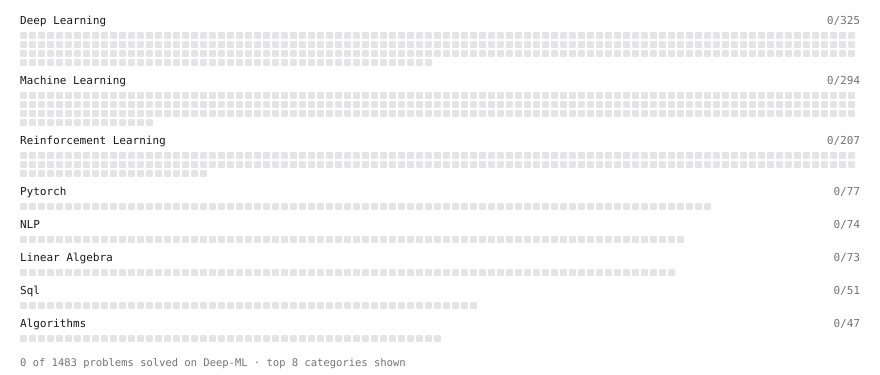

# Deep-ML

My machine learning practice from [Deep-ML](https://www.deep-ml.com). Every solution here was written by hand.

**68** solved · 57 problems · 0 labs · 11 math

[**Browse the interactive portfolio**](https://alexliap.github.io/deep-ml/) to replay this filling in over time.

## Problems

| | Difficulty | Solved | |
| --- | --- | --- | --- |
| [Batch Iterator for Dataset](https://www.deep-ml.com/problems/30) | easy | 2026-09-27 | [solution](problems/0030-batch-iterator-for-dataset) |
| [Calculate 2x2 Matrix Inverse](https://www.deep-ml.com/problems/8) | easy | 2025-03-21 | [solution](problems/0008-calculate-2x2-matrix-inverse) |
| [Calculate Accuracy Score](https://www.deep-ml.com/problems/36) | easy | 2026-09-27 | [solution](problems/0036-calculate-accuracy-score) |
| [Calculate Covariance Matrix](https://www.deep-ml.com/problems/10) | easy | 2026-05-04 | [solution](problems/0010-calculate-covariance-matrix) |
| [Calculate Image Brightness](https://www.deep-ml.com/problems/70) | easy | 2026-09-27 | [solution](problems/0070-calculate-image-brightness) |
| [Calculate Mean by Row or Column](https://www.deep-ml.com/problems/4) | easy | 2025-03-21 | [solution](problems/0004-calculate-mean-by-row-or-column) |
| [Calculate Model Inference Statistics for Monitoring](https://www.deep-ml.com/problems/248) | easy | 2026-09-30 | [solution](problems/0248-calculate-model-inference-statistics-for-monitoring) |
| [Compute Multi-class Cross-Entropy Loss](https://www.deep-ml.com/problems/134) | easy | 2026-09-16 | [solution](problems/0134-compute-multi-class-cross-entropy-loss) |
| [Convert Vector to Diagonal Matrix](https://www.deep-ml.com/problems/35) | easy | 2026-09-27 | [solution](problems/0035-convert-vector-to-diagonal-matrix) |
| [Derivative of a Polynomial](https://www.deep-ml.com/problems/116) | easy | 2026-04-26 | [solution](problems/0116-derivative-of-a-polynomial) |
| [Feature Scaling Implementation](https://www.deep-ml.com/problems/16) | easy | 2024-11-22 | [solution](problems/0016-feature-scaling-implementation) |
| [Gradient Direction and Magnitude](https://www.deep-ml.com/problems/308) | easy | 2026-04-26 | [solution](problems/0308-gradient-direction-and-magnitude) |
| [Implement a Simple Residual Block with Shortcut Connection](https://www.deep-ml.com/problems/113) | easy | 2026-09-29 | [solution](problems/0113-implement-a-simple-residual-block-with-shortcut-connection) |
| [Implement Gini Impurity Calculation for a Set of Classes](https://www.deep-ml.com/problems/64) | easy | 2024-11-22 | [solution](problems/0064-implement-gini-impurity-calculation-for-a-set-of-classes) |
| [Implement Orthogonal Projection of a Vector onto a Line](https://www.deep-ml.com/problems/66) | easy | 2026-09-27 | [solution](problems/0066-implement-orthogonal-projection-of-a-vector-onto-a-line) |
| [Implement Precision Metric](https://www.deep-ml.com/problems/46) | easy | 2026-09-27 | [solution](problems/0046-implement-precision-metric) |
| [Implement Recall Metric in Binary Classification](https://www.deep-ml.com/problems/52) | easy | 2026-09-27 | [solution](problems/0052-implement-recall-metric-in-binary-classification) |
| [Implement ReLU Activation Function](https://www.deep-ml.com/problems/42) | easy | 2025-03-21 | [solution](problems/0042-implement-relu-activation-function) |
| [Implement the ELU Activation Function](https://www.deep-ml.com/problems/97) | easy | 2025-03-21 | [solution](problems/0097-implement-the-elu-activation-function) |
| [Implement the Hard Sigmoid Activation Function](https://www.deep-ml.com/problems/96) | easy | 2025-03-21 | [solution](problems/0096-implement-the-hard-sigmoid-activation-function) |
| [Implement the SELU Activation Function](https://www.deep-ml.com/problems/103) | easy | 2025-03-23 | [solution](problems/0103-implement-the-selu-activation-function) |
| [Implement the Softplus Activation Function](https://www.deep-ml.com/problems/99) | easy | 2025-03-21 | [solution](problems/0099-implement-the-softplus-activation-function) |
| [Implement the Softsign Activation Function](https://www.deep-ml.com/problems/100) | easy | 2025-03-21 | [solution](problems/0100-implement-the-softsign-activation-function) |
| [Implement the Swish Activation Function](https://www.deep-ml.com/problems/102) | easy | 2025-03-21 | [solution](problems/0102-implement-the-swish-activation-function) |
| [Implementation of Log Softmax Function](https://www.deep-ml.com/problems/39) | easy | 2024-12-01 | [solution](problems/0039-implementation-of-log-softmax-function) |
| [Leaky ReLU Activation Function](https://www.deep-ml.com/problems/44) | easy | 2025-03-21 | [solution](problems/0044-leaky-relu-activation-function) |
| [Linear Kernel Function](https://www.deep-ml.com/problems/45) | easy | 2026-09-27 | [solution](problems/0045-linear-kernel-function) |
| [Linear Regression Using Gradient Descent](https://www.deep-ml.com/problems/15) | easy | 2026-05-05 | [solution](problems/0015-linear-regression-using-gradient-descent) |
| [Linear Regression Using Normal Equation](https://www.deep-ml.com/problems/14) | easy | 2024-11-22 | [solution](problems/0014-linear-regression-using-normal-equation) |
| [Matrix-Vector Dot Product](https://www.deep-ml.com/problems/1) | easy | 2024-11-22 | [solution](problems/0001-matrix-vector-dot-product) |
| [Random Shuffle of Dataset](https://www.deep-ml.com/problems/29) | easy | 2026-09-28 | [solution](problems/0029-random-shuffle-of-dataset) |
| [ReLU with JAX Arrays](https://www.deep-ml.com/problems/1323) | easy | 2026-09-30 | [solution](problems/1323-relu-with-jax-arrays) |
| [Reshape Matrix](https://www.deep-ml.com/problems/3) | easy | 2024-12-01 | [solution](problems/0003-reshape-matrix) |
| [Scalar Multiplication of a Matrix](https://www.deep-ml.com/problems/5) | easy | 2025-03-21 | [solution](problems/0005-scalar-multiplication-of-a-matrix) |
| [Sigmoid Activation Function Understanding](https://www.deep-ml.com/problems/22) | easy | 2024-11-22 | [solution](problems/0022-sigmoid-activation-function-understanding) |
| [Single Neuron](https://www.deep-ml.com/problems/24) | easy | 2024-11-22 | [solution](problems/0024-single-neuron) |
| [Softmax Activation Function Implementation ](https://www.deep-ml.com/problems/23) | easy | 2024-11-22 | [solution](problems/0023-softmax-activation-function-implementation) |
| [Transformation Matrix from Basis B to C](https://www.deep-ml.com/problems/27) | easy | 2026-09-16 | [solution](problems/0027-transformation-matrix-from-basis-b-to-c) |
| [Transpose of a Matrix](https://www.deep-ml.com/problems/2) | easy | 2024-11-22 | [solution](problems/0002-transpose-of-a-matrix) |
| [Your First Gradient with jax.grad](https://www.deep-ml.com/problems/1325) | easy | 2026-09-30 | [solution](problems/1325-your-first-gradient-with-jax-grad) |
| [Boxed Answer Extraction for Math Benchmarks](https://www.deep-ml.com/problems/318) | medium | 2026-10-01 | [solution](problems/0318-boxed-answer-extraction-for-math-benchmarks) |
| [Calculate Eigenvalues of a Matrix](https://www.deep-ml.com/problems/6) | medium | 2025-03-21 | [solution](problems/0006-calculate-eigenvalues-of-a-matrix) |
| [Direct Preference Optimization (DPO) Loss](https://www.deep-ml.com/problems/382) | medium | 2026-10-02 | [solution](problems/0382-direct-preference-optimization-dpo-loss) |
| [Implement K-Fold Cross-Validation](https://www.deep-ml.com/problems/18) | medium | 2026-10-04 | [solution](problems/0018-implement-k-fold-cross-validation) |
| [Implement PReLU Forward and Backward Pass](https://www.deep-ml.com/problems/98) | medium | 2025-03-21 | [solution](problems/0098-implement-prelu-forward-and-backward-pass) |
| [Implement Self-Attention Mechanism](https://www.deep-ml.com/problems/53) | medium | 2026-04-26 | [solution](problems/0053-implement-self-attention-mechanism) |
| [K-Means Clustering](https://www.deep-ml.com/problems/17) | medium | 2025-03-21 | [solution](problems/0017-k-means-clustering) |
| [Matrix times Matrix ](https://www.deep-ml.com/problems/9) | medium | 2025-03-21 | [solution](problems/0009-matrix-times-matrix) |
| [Matrix Transformation ](https://www.deep-ml.com/problems/7) | medium | 2025-03-21 | [solution](problems/0007-matrix-transformation) |
| [MMLU Letter-Matching Evaluation](https://www.deep-ml.com/problems/326) | medium | 2026-09-16 | [solution](problems/0326-mmlu-letter-matching-evaluation) |
| [MMLU Log-Probability Scoring](https://www.deep-ml.com/problems/316) | medium | 2026-09-30 | [solution](problems/0316-mmlu-log-probability-scoring) |
| [Numerical Gradient Checking](https://www.deep-ml.com/problems/313) | medium | 2026-09-16 | [solution](problems/0313-numerical-gradient-checking) |
| [Sliding Window Attention](https://www.deep-ml.com/problems/388) | medium | 2026-10-06 | [solution](problems/0388-sliding-window-attention) |
| [Solve Linear Equations using Jacobi Method](https://www.deep-ml.com/problems/11) | medium | 2026-05-04 | [solution](problems/0011-solve-linear-equations-using-jacobi-method) |
| [Top-p (Nucleus) Sampling](https://www.deep-ml.com/problems/383) | medium | 2026-10-01 | [solution](problems/0383-top-p-nucleus-sampling) |
| [Positional Encoding Calculator](https://www.deep-ml.com/problems/85) | hard | 2026-09-29 | [solution](problems/0085-positional-encoding-calculator) |
| [Speculative Decoding End-to-End Simulation](https://www.deep-ml.com/problems/410) | hard | 2026-10-02 | [solution](problems/0410-speculative-decoding-end-to-end-simulation) |

## Math

| | Difficulty | Solved | |
| --- | --- | --- | --- |
| [Adjacency, Degree and the Normalized Adjacency Matrix](https://www.deep-ml.com/math-problems/187) | easy | 2026-09-28 | [solution](math/0187-adjacency-degree-and-the-normalized-adjacency-matrix) |
| [ASR Serving Arithmetic: Real-Time Factor, Streams and Parallel Chunks](https://www.deep-ml.com/math-problems/174) | easy | 2026-09-28 | [solution](math/0174-asr-serving-arithmetic-real-time-factor-streams-and-parallel-chunks) |
| [Class Imbalance and Proper Scoring](https://www.deep-ml.com/math-problems/44) | easy | 2026-09-29 | [solution](math/0044-class-imbalance-and-proper-scoring) |
| [Cost per Million Tokens and the Break-Even Point](https://www.deep-ml.com/math-problems/169) | easy | 2026-09-29 | [solution](math/0169-cost-per-million-tokens-and-the-break-even-point) |
| [Derivatives and Gradients](https://www.deep-ml.com/math-problems/1) | easy | 2026-09-29 | [solution](math/0001-derivatives-and-gradients) |
| [LoRA Parameter and Compute Arithmetic](https://www.deep-ml.com/math-problems/154) | easy | 2026-09-28 | [solution](math/0154-lora-parameter-and-compute-arithmetic) |
| [ML Workflow Basics](https://www.deep-ml.com/math-problems/30) | easy | 2026-09-28 | [solution](math/0030-ml-workflow-basics) |
| [Perplexity as Exponentiated Cross-Entropy](https://www.deep-ml.com/math-problems/164) | easy | 2026-09-29 | [solution](math/0164-perplexity-as-exponentiated-cross-entropy) |
| [TTS Serving Arithmetic: Token Rates, Buffers and Time to First Audio](https://www.deep-ml.com/math-problems/175) | easy | 2026-09-28 | [solution](math/0175-tts-serving-arithmetic-token-rates-buffers-and-time-to-first-audio) |
| [Vector Operations](https://www.deep-ml.com/math-problems/7) | easy | 2026-09-29 | [solution](math/0007-vector-operations) |
| [Effective Rank and the Entropy of a Spectrum](https://www.deep-ml.com/math-problems/125) | medium | 2026-09-28 | [solution](math/0125-effective-rank-and-the-entropy-of-a-spectrum) |

---

_This file is regenerated by Deep-ML on every push._
